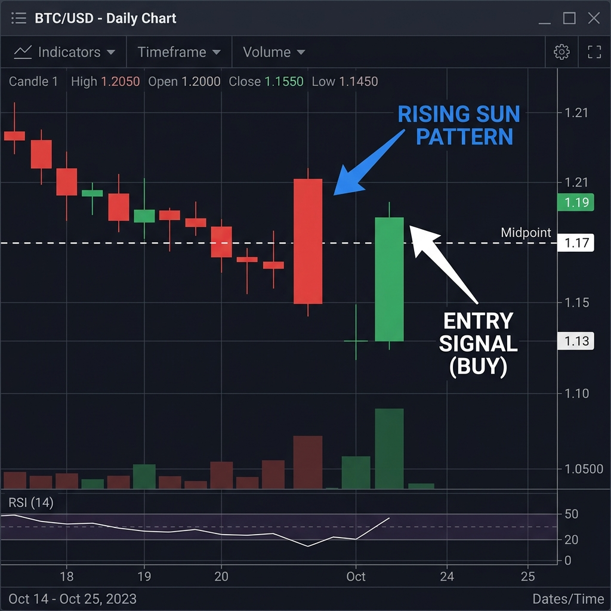
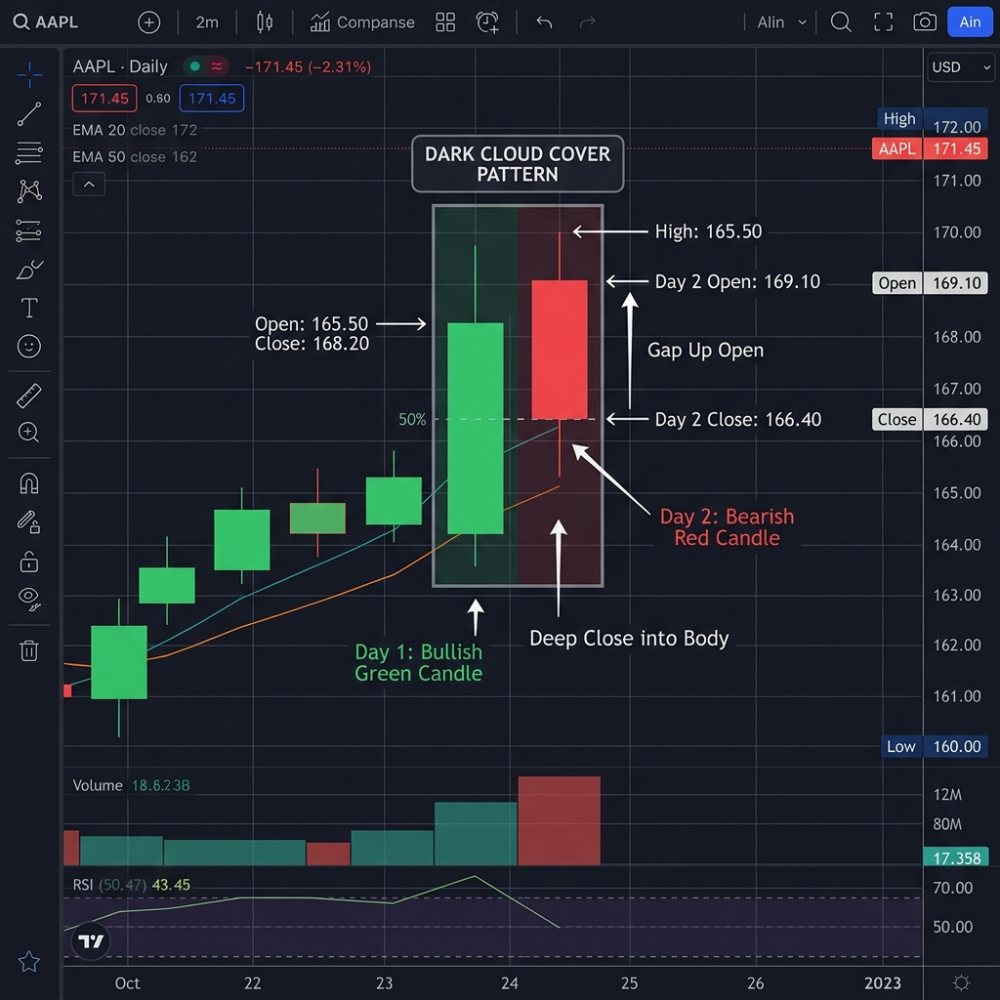
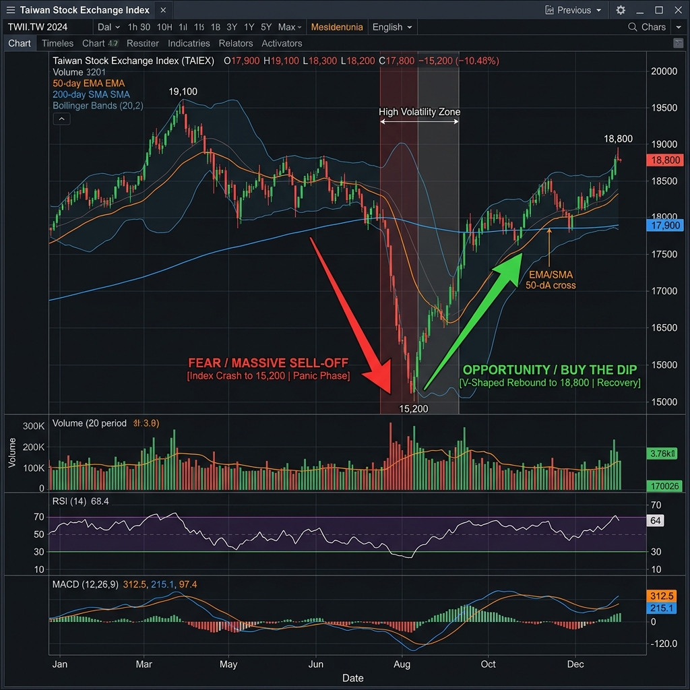

# 大師心法：勝率八成不是夢
> 贏在起跑點：心理建設與資金配置

## 交易的真相
### 💡 為什麼你總是賠錢？
- **過度預測**：總想抓到最低點或最高點，結果被市場修理。
- **重倉交易**：一筆虧損就傷筋動骨，導致不敢執行停損。
- **訊號焦慮**：看到影就開槍，沒有等到真正的「絕對領先訊號」。

> **小白 Tips：什麼是重倉？**
> 如果一筆交易的虧損會讓你晚上睡不著覺，那就是重倉。大師建議：每筆交易的風險應控制在總資金的 1%～2% 以內。

### 🛡️ 勝率八成的秘密
- **只打全壘打球**：不符合訊號的盤絕對不碰。
- **高盈虧比優先**：即便勝率只有五成，只要盈虧比大，你還是贏家。但我們追求的是「訊號出現 -> 八成機率往目標前進」。

---

# 核心技術：判讀高勝率訊號
> 看到訊號就下單，不需要懷疑

## 關鍵 15 分 K 線組合
### 🌅 旭日東昇（破曉訊號）
- **形態**：長黑 K 後接跳空缺口，且隨後紅 K 吞噬黑 K 高點。
- **量能**：紅 K 必須帶量。
- **動作**：紅 K 收盤即進場，停損點設在黑 K 低點。

[tags]
- [green] 強力作多訊號
- [blue] 進場點：紅 K 收盤
[/tags]

### ⛈️ 烏雲罩頂（撤退訊號）
- **形態**：高檔長紅 K 後，隔根開高走低跌破紅 K 二分之一處。
- **動作**：立即減碼或反手放空。

## 均線扣離法
> 預判均線未來的方向

[flow]
1. 找出目前的扣抵位置。
2. 觀察今日收盤價與扣抵價的距離。
3. 若今日價格高於扣抵價，均線必將上揚，形成支撐。
[/flow]

---

# 夜盤攻略：24 小時不打烊的賺錢機會
> 夜盤是避險者的天堂，更是短線客的提款機

## 夜盤與美股的圓舞曲
### 🇺🇸 盯住小那 (Nasdaq)
- 台指期夜盤與 Nasdaq 相關係數高達 0.9。
- **必看指標**：美股開盤後的第一個 30 分鐘趨勢。

### 🕒 夜盤進場時機
- **九點半開盤衝動期**：波動最大，適合抓轉折。
- **凌晨一點半結算期**：波動縮小，適合區間操作。

> **小白 Tips：夜盤一定要看嗎？**
> 除非你沒部位，否則夜盤是用來「調整風險」的。如果美股大跌，你卻在睡覺，明天開盤可能直接斷頭。

---

# 實戰案例：2024 大波動拆解
> 歷史會重演，但只會演給準的人看

## 案例 A：4 月大震盪洗盤
### 🏗️ 為什麼大師在這邊敢加碼？
- **場景**：指數跌破月線，全市場都在恐慌。
- **觀察**：即便跌破，但 15 分 K 出現「旭日東昇」，且法人淨空單大幅減少。
- **動作**：分批進場，獲利翻倍。

> **小白 Tips：法人的訊號**
> 大師不只看技術面，更看大戶的臉色。當散戶都在逃命，法人卻在收貨，這就是「訊號」。

[image-text position="right" width="50"]

這是當時實戰的 K 線圖截圖。
- **A 點 (Fear)**：洗盤低點，散戶恐慌。
- **B 點 (Signal)**：訊號確認，大師進場點。
- **C 點 (Profit)**：高檔盤整，獲利出場位。
[/image-text]

---

# 修煉之道：紀律與執行力
> 技術是骨，紀律是魂

## 贏家的每日儀式
[summary]
- 📝 **紀錄交易** | 無論盈虧，寫下當下的心情與原因。
- 🛑 **無條件停損** | 看到停損位，像機器人一樣按下平倉鍵。
- 🧘 **保持空靈** | 不要帶情緒交易，市場不欠你，你也沒欠市場。
[/summary]

> **最後的叮嚀**
> 訊號出現時，想是問題，做是答案。

---
