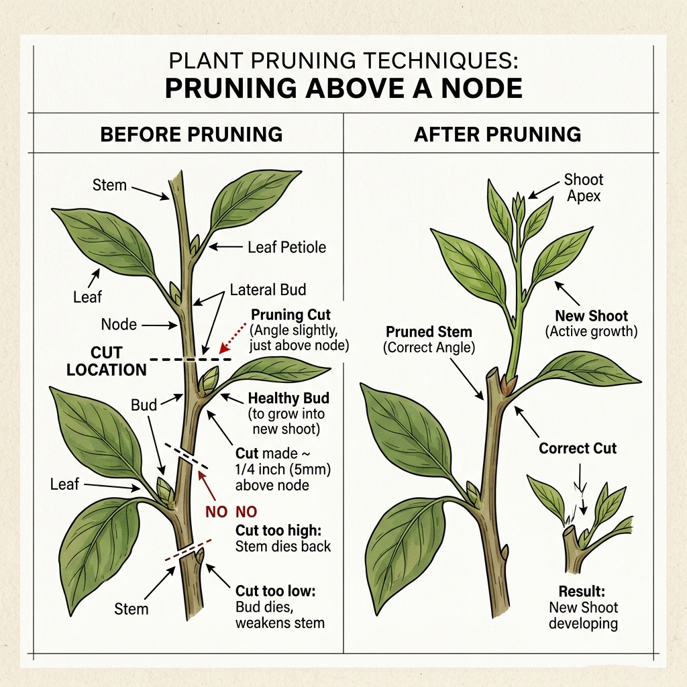

# 修剪的基本心法：為什麼要剪？
> 修剪（Pruning）是植栽維護中最重要的工藝。它不只是為了好看，更是為了植物的生存與繁衍。

## 💡 修剪的核心價值
### ✨ 促進健康
- 移除病弱枝、枯葉，減少病害蔓延。
- 改善透風，降低夏季悶熱造成的爛根風險。

### 🎨 塑造美感
- 控制植物高度，適應室內空間。
- 引導生長方向，形成獨特的視覺層次。

### 🚀 激發生機
- 透過修剪觸發植物的「代償生長」，讓它長得更茂密。

---

# 核心剪法：植栽大師的三大板斧
> 不同的植物需要不同的對待方式，掌握這三種剪法，你就能應對 90% 的植栽。

[image-text position="right" width="45"]

### 📍 精準切割的秘密
切口應位於**芽點（Node）上方約 0.5 公分處**。
- [blue] 疏剪 (Thinning)：從基部整枝移除，不留殘樁，常用於改善通風。
- [orange] 短截 (Heading)：剪去枝條末端，強迫側芽萌發，讓植栽變矮胖。
- [purple] 回縮 (Rejuvenation)：大幅度修剪老舊枝條，促使植栽重新發芽。
[/image-text]

> **大師洞察**
> 切角建議呈 45 度斜角，防止水分在切口積聚造成潰爛。

---

# 實戰案例：美感與技術的結合
> 針對不同的熱門植栽，我們有不同的處理策略。

## 🌿 案例一：蔓綠絨 (Philodendron)
蔓綠絨具有強大的頂端優勢，若不修剪會長成「竹竿」。

### ✂️ 修剪要點
- **控制垂墜感**：當蔓綠絨長得太長時，在節與節之間下刀。
- **生根誘導**：剪下的枝條若帶有「氣根」，直接水培就能獲得新植株。
- **誘發分枝**：剪掉頂芽後，下方的休眠芽點會在兩週內甦醒。

## 🌸 案例二：蘭花 (Orchid) —— 特別追加
蘭花的花期過後，正確的修剪決定了明年是否能再次開花。

### ✂️ 花梗修剪術
- **續花法**：若花梗仍翠綠，可從基部往上數第 2-3 節（芽點）上方剪斷，有機會從該處長出新花序。
- **休養法**：從花梗基部完全剪除。這能讓植物將養分轉移至根系與新葉，為明年大爆發做準備。

[tags]
- [orange] 注意：修剪蘭花前，剪刀務必火烤或用酒精澈底消毒。
- [blue] 建議：花梗乾枯後才剪除，可讓養分回流。
[/tags]

## 🌵 案例三：多肉植物 (Succulents)
多肉植物的修剪通常被稱為「砍頭」。

### ✂️ 爆盆技巧
- **打破頂端優勢**：剪掉頂端後，原本的莖幹會從側邊冒出 3-5 個側芽。
- **傷口晾乾**：修剪後務必放置陰涼處 3-5 天，待傷口結痂後再澆水。

---

# 🏆 學習總結
[summary]
- 🌳 **觀察芽點** | 所有的生長力量都儲存在芽點，剪對位置才有新分支。
- 🛠️ **工具消毒** | 預防勝於治療，不要讓修剪變成病黴菌的感染源。
- 👁️ **適時留白** | 修剪不只是減法，更是為了未來的加法預留空間。
[/summary]
